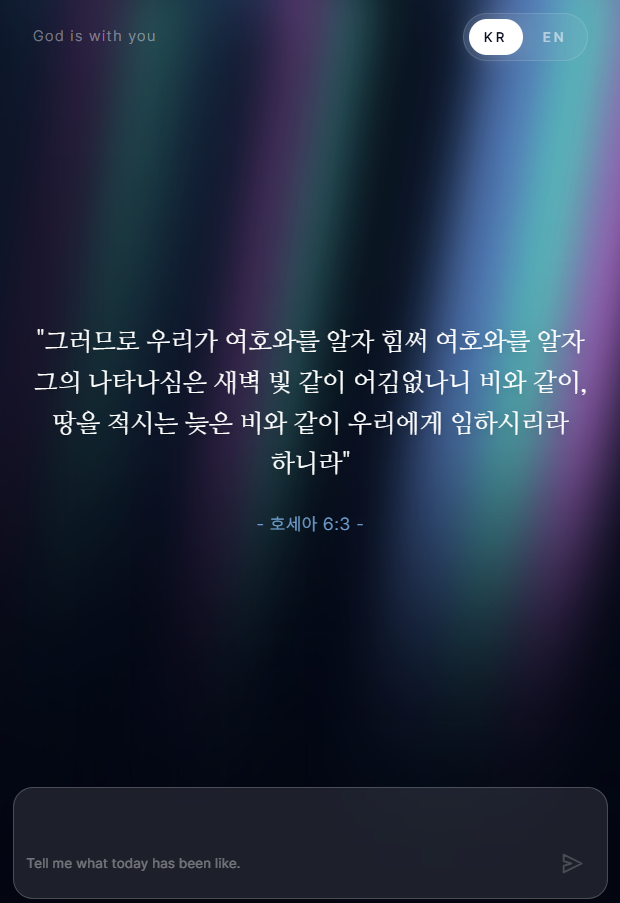
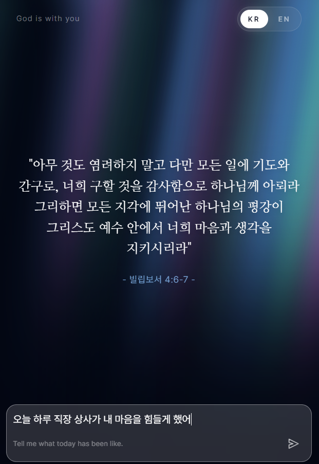

# God is with You

A full-stack web application that provides Bible verses and personalized comfort messages powered by AI.

## Overview

**God is with You** offers two ways for users to connect with Scripture:

1. **Daily Verse**: A randomly selected daily Bible verse
2. **Custom Situation**: Personalized Bible verses generated based on the user's specific situation or emotional state

The application supports Korean and English, with a responsive design optimized for both desktop and mobile devices.

## Architecture

```
┌─────────────────────────────────────────────────────┐
│                    Frontend (Client)                 │
│   React 18 + Vite + Tailwind CSS (Port 5173)       │
│  ├─ Daily Verse Display                            │
│  ├─ Custom Message Input                           │
│  ├─ Language Selector (KR/EN)                      │
│  └─ Responsive UI                                   │
└────────────────────┬────────────────────────────────┘
                     │ HTTP/REST
                     │
┌────────────────────▼────────────────────────────────┐
│                    Backend (Server)                  │
│   FastAPI + Google Gemini AI (Port 8000)           │
│  ├─ GET /api/v1/daily-verse                        │
│  ├─ POST /api/v1/custom-message                    │
│  ├─ Daily Verse Caching                            │
│  └─ CORS Enabled                                    │
└─────────────────────────────────────────────────────┘
```

## Key Features

- **Daily Verse**: Fetches a random Bible verse with caching to optimize API usage
- **AI-Powered Personalization**: Uses Google Gemini to generate contextual Bible verses based on user situations
- **Multi-language Support**: Seamlessly switch between Korean and English with persistent preferences
- **Responsive Design**: Optimized for all device sizes
- **Production Ready**: Docker support for easy deployment

## Project Structure

```
god-is-with-you/
├── client/              # React frontend application
│   └── [See client/README.md for details]
├── server/              # FastAPI backend service
│   └── [See server/README.md for details]
└── README.md           # This file
```

## Quick Start

### Prerequisites
- Node.js 18+ (for frontend)
- Python 3.11+ (for backend)
- Google Gemini API key

### Setup

1. **Frontend Setup**
   ```bash
   cd client
   npm install
   npm run dev
   ```
   Runs at `http://localhost:5173`

2. **Backend Setup**
   ```bash
   cd server
   pip install -r requirements.txt
   echo "GEMINI_API_KEY=your_key_here" > .env
   uvicorn main:app --reload --host 0.0.0.0 --port 8000
   ```
   Runs at `http://localhost:8000`

For detailed setup instructions, see [client/README.md](client/README.md) and [server/README.md](server/README.md).

## Features Preview

### Daily Verse


### Custom Situation


## API Endpoints

| Endpoint | Method | Purpose |
|----------|--------|---------|
| `/api/v1/daily-verse` | GET | Fetch daily Bible verse (with optional personalization) |
| `/api/v1/custom-message` | POST | Generate personalized message based on situation |
| `/health` | GET | Health check |
| `/docs` | GET | Interactive API documentation (Swagger UI) |

## Deployment

Both services include Docker support:

```bash
# Backend
cd server
docker build -t god-is-with-you-api .
docker run --rm -p 8000:8000 --env-file .env god-is-with-you-api
```

## Technology Stack

| Layer | Technology |
|-------|-----------|
| Frontend | React 18, Vite, Tailwind CSS v4 |
| Backend | FastAPI, Python 3.11+, Google Generative AI |
| Styling | Tailwind CSS |
| Deployment | Docker |

## License

[Add your license here]
